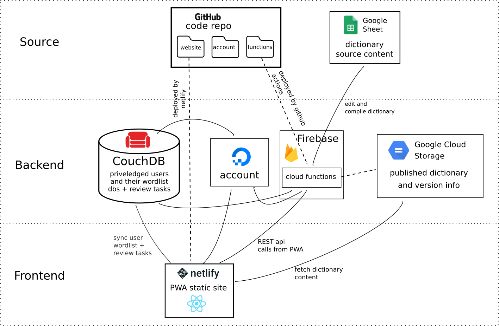

# LingDocs Dictionary Monorepo

[](https://www.gnu.org/licenses/gpl-3.0)
[](https://app.netlify.com/sites/lingdocs-dictionary/deploys)


## Contents

This monorepo contains:
 - `/dictionary-client` the frontend of the dictionary, a React SPA
 - `/account` a backend authentication server
 - `/functions` backend Firebase functions for use with the dictionary

To update the `@lingdocs/pashto-inflector` dependency accross the project you can use the shell script included:

```sh
./update-inflector.sh [version]
```

### Dictionary Client

SPA Dictionary Frontend

Use [Yarn](https://yarnpkg.com/).

```sh
cd website
yarn install
```

#### Development

```sh
yarn start
```

### Account

Backend authentication server build on express / passport

#### Development

Use [npm](https://www.npmjs.com/).

```sh
cd account
npm install
npm run dev
```

### Functions

Backend Firebase functions

Use [npm](https://www.npmjs.com/).

```sh
cd functions
npm install
```

#### Development

```sh
firebase login
# get envars locally
firebase functions:config:get > .runtimeconfig.json
# start functions emulator
npm run serve
```

## Architecture

**TODO: Diagram out of date as we are now using Cloudflare Cloud Storage instead**



### Source Layer

#### GitHub Git Repo

The monorepo contains both a `website` folder for the frontend PWA and a `functions` folder for the backend functions. Both parts are written in TypeScript and are tied together using the types found in the `@lingdocs/pashto-inflector` package used by both as well as the types found in `./website/src/lib/backend-types.ts`

##### `./website` frontend

The front-end website code in `./website` is made with `create-react-app` and written in typescript with `jest` testing. It is a SPA and PWA.

The deployment is done automatically by netlify upon pushing to the `master` branch.

##### `./functions` backend

The backend code found in `./functions` and is written in TypeScript.

It is compiled and deployed automatically by the repo's GitHub Actions to Firebase Cloud Functions upon pushing to the `master` branch.

#### Google Sheets Dictionary Source

The content of the dictionary is based on a Google Sheets documents containing rows with the information for each dictionary entry. This can be edited by an editor directly, or through the website frontend with editor priveledges.

A cloud function in the backend compiles the dictionary into binary form (protobuf) then uploads it into a Google Cloud Storage bucket. The deployment is triggered from the website by an editor.

### Backend Layer

#### Firebase Functions

Serverless functions are used in conjungtion with Firebase Authentication to:
- check if a user has elevated priveledges
- receive edits or suggestions for the dictionary
- compile and publish the dictionary
- create and clean up elevated users in the CouchDB database

#### Account Server

Deployed through a self-hosted actions runner. It runs on an Ubuntu 20.04 machine and it requries `node` and `redis`.

The runner is launched by this line in a crontab

```
@reboot ./actions-runner/run.sh
```

Process managed by pm2 using this `ecosystem.config.js`

```
module.exports = {
  apps : [{
    name   : "account",
    cwd : "./actions-runner/_work/lingdocs-main/lingdocs-main/account",
    script: "npm",
    args: "start",
    env: {
        NODE_ENVIRONMENT: "************",
        LINGDOCS_EMAIL_HOST: "**************",
        LINGDOCS_EMAIL_USER: "**************",
        LINGDOCS_EMAIL_PASS: "*****************",
        LINGDOCS_COUCHDB: "****************",
        LINGDOCS_ACCOUNT_COOKIE_SECRET: "******************",
        LINGDOCS_ACCOUNT_GOOGLE_CLIENT_SECRET: "******************",
        LINGDOCS_ACCOUNT_TWITTER_CLIENT_SECRET: "******************",
        LINGDOCS_ACCOUNT_GITHUB_CLIENT_SECRET: "******************",
        LINGDOCS_ACCOUNT_RECAPTCHA_SECRET: "6LcVjAUcAAAAAPWUK-******************",
    }
  }]
}
```

```sh
pm2 start ecosystem.config.js
pm2 save
```

Put behind a NGINX reverse proxy with this config (encryption by LetsEncrypt)

```
server {
    server_name account.lingdocs.com;

    location / {
        proxy_pass http://localhost:4000;
        proxy_http_version 1.1;
        proxy_set_header Upgrade $http_upgrade;
        proxy_set_header Connection 'upgrade';
        proxy_set_header Access-Control-Allow-Origin *;
        proxy_set_header Host $host;
        proxy_set_header X-Forwarded-Proto $scheme;
        proxy_cache_bypass $http_upgrade;
    }

    error_page 500 /500.json;
    location /500.json {
        return 500 '{"ok":false,"error":"500 Internal Server Error"}';
    }

    error_page 502 /502.json;
    location /502.json {
        return 502 '{"ok":false,"error":"502 Bad Gateway"}';
    }

    error_page 503 /503.json;
    location /503.json {
        return 503 '{"ok":false,"error":"503 Service Temporarily Unavailable"}';
    }

    error_page 504 /504.json;
    location /504.json {
        return 504 '{"ok":false,"error":"504 Gateway Timeout"}';
    }

    listen [::]:443 ssl ipv6only=on; # managed by Certbot
    listen 443 ssl; # managed by Certbot
    ssl_certificate /etc/letsencrypt/live/account.lingdocs.com/fullchain.pem; # managed by Certbot
    ssl_certificate_key /etc/letsencrypt/live/account.lingdocs.com/privkey.pem; # managed by Certbot
    include /etc/letsencrypt/options-ssl-nginx.conf; # managed by Certbot
    ssl_dhparam /etc/letsencrypt/ssl-dhparams.pem; # managed by Certbot

}
server {
    if ($host = account.lingdocs.com) {
        return 301 https://$host$request_uri;
    } # managed by Certbot


        server_name account.lingdocs.com;

        listen 80;
        listen [::]:80;
    return 404; # managed by Certbot

}
```

#### CouchDB

When a user upgrades their account level to `student` or `editor`:

1. A doc in the `_users` db is created with their Firebase Authentication info, account level, and a password they can use for syncing their personal wordlistdb
2. A user database is created which they use to sync their personal wordlist.  

There is also a `review-tasks` database which is used to store all the review tasks for editors and syncs with the review tasks in the app for the editor(s). 

#### Google Cloud Storage

Contains:

- `dict` - the dictionary content in protobuf format
- `dict-info` - information about the version of the currently available dictionary in protobuf format

The website fetches `dict-info` and `dict` as needed to check for the latest dictionary version and download it into memory/`lokijs`.

### Frontend Layer

#### PWA

The frontend is a static-site PWA/SPA built with `create-react-app` (React/TypeScript) and deployed to Netlify.


